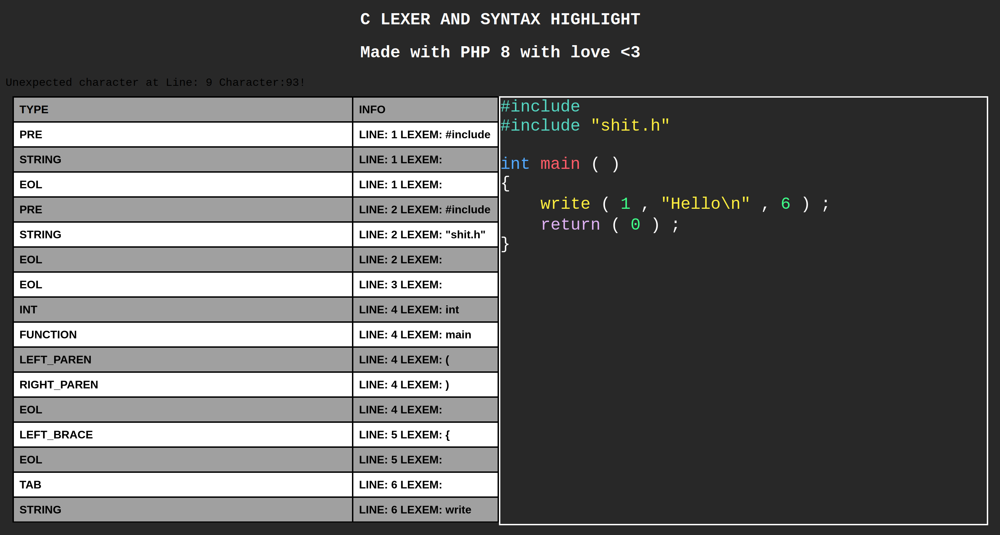

# PHC
### Small C lexer written with PHP.

It doesn't support a lot of things and will return a lot of errors for big source files.
The code is there but i have no intention to support all the C syntax.

## 

